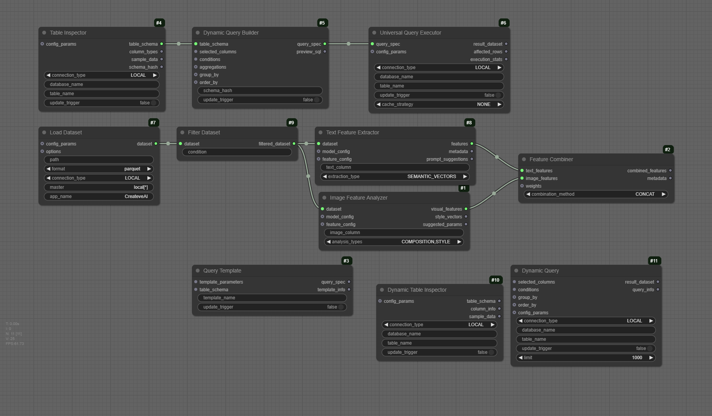

# CreateveAI Apache Spark Nodes for ComfyUI

Custom nodes providing Apache Spark and Databricks integration for ComfyUI, enabling advanced data processing, feature extraction, and analysis capabilities for AI workflows. 



## 🌟 Features

- **Dataset Management**: Create, load, save and filter datasets with Spark
- **Dynamic Querying**: Inspect tables, build dynamic queries, and execute them with caching
- **Feature Extraction**: Extract features from text and images using state-of-the-art models
- **Spark Integration**: Support for both local Spark and Databricks environments
- **Smart Analysis**: Extract meaningful patterns and insights from your data
- **Progress Tracking**: Real-time progress updates for long-running operations
- **Docker Support**: Ready-to-use containerized environment for development

## 🛠️ Manual Installation

1. Clone this repository into your ComfyUI custom nodes directory:
```bash
cd /path/to/ComfyUI/custom_nodes
git clone https://github.com/spgoodman/createveai-comfyui-apachespark.git
```

2. Install dependencies:
```bash
cd createveai-comfyui-apachespark
pip install -r requirements.txt

# Install optional model files
python -m spacy download en_core_web_sm
```

## 🚀 Quick Start with Docker for Development

The easiest way to get started is using Docker Compose:

```bash
# Clone the repository
git clone https://github.com/spgoodman/createveai-comfyui-apachespark.git
cd createveai-comfyui-apachespark

# Start the environment
docker-compose up -d

# Access services:
# - ComfyUI: http://localhost:8181
# - Jupyter: http://localhost:8888
# - Spark UI: http://localhost:8080
```

## ⚙️ Configuration

### Local Spark Setup
The default configuration uses local Spark mode. No additional setup is required.

### Databricks Setup
To use Databricks:

1. Create a `.env` file in your home directory:
```bash
DATABRICKS_HOST=your-workspace-url
DATABRICKS_TOKEN=your-access-token
```

2. Configure the connection in ComfyUI using the TableInspector node.

## 📦 Available Nodes

### Dataset Nodes
- **Create Dataset**: Create new datasets with custom schemas
- **Load Dataset**: Load existing datasets from various formats
- **Save Dataset**: Save datasets with metadata
- **Filter Dataset**: Filter datasets using SQL-like conditions

### Query Nodes
- **Table Inspector**: Auto-updating schema inspection
- **Dynamic Query Builder**: Visual query construction
- **Universal Query Executor**: Optimized query execution

### Feature Extraction Nodes
- **Text Feature Extractor**:
  - Semantic Vectors (Sentence Transformers)
  - Keywords (YAKE)
  - Named Entities (spaCy)
  - Sentiment Analysis
  - Topic Modeling

- **Image Feature Analyzer**:
  - Composition Analysis
  - Color Palette Extraction
  - Object Detection
  - Style Analysis
  - Aesthetics Scoring

- **Feature Combiner**:
  - Simple Concatenation
  - Weighted Combination
  - Cross-Attention Fusion

## 🎯 Example Workflows

### 1. ComfyUI Nodes

[Example ComfyUI Workflow](examples/workflows/)

This workflow is an initial example of various node combinations.

### 2. Dataset Creation and Analysis
```python
# Run the Jupyter notebook:
examples/notebooks/01_generate_sample_dataset.ipynb
```
This notebook demonstrates:
- Setting up Spark connection
- Creating sample datasets
- Basic data analysis
- Saving datasets with metadata

## 🔧 Development Setup

### Prerequisites
- Docker and Docker Compose
- Python 3.10+
- Java 11+ (for local development)

### Development Environment
1. Clone the repository
2. Start the development environment:
```bash
docker-compose up -d
```

3. Access development tools:
- ComfyUI: http://localhost:8181
- Jupyter Lab: http://localhost:8888
- Spark UI: http://localhost:8080

## 📚 Documentation

Detailed documentation is available in the `docs` directory:
- [Getting Started](docs/getting-started/)
- [Node Reference](docs/nodes/)
- [Example Workflows](docs/examples/)
- [API Reference](docs/api/)

## 📄 License

MIT License. See [LICENSE](LICENSE) file for details.

## 🔗 Links

- [ComfyUI Repository](https://github.com/comfyanonymous/ComfyUI)
- [Apache Spark](https://spark.apache.org/)
- [Project Issues](https://github.com/spgoodman/createveai-comfyui-apachespark/issues)
